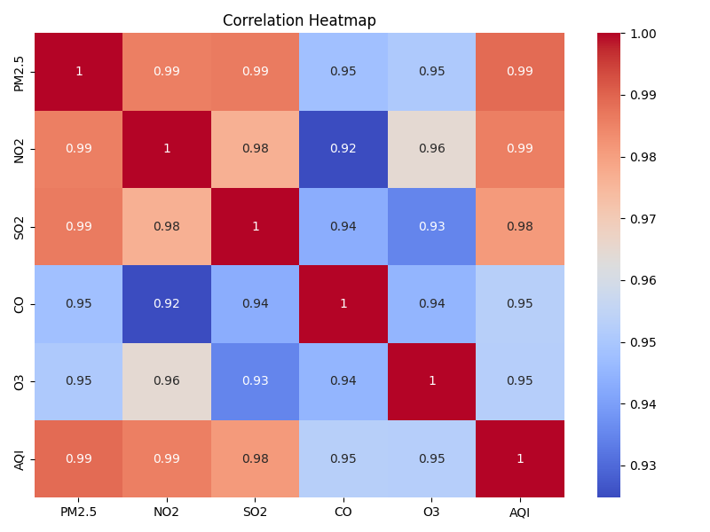
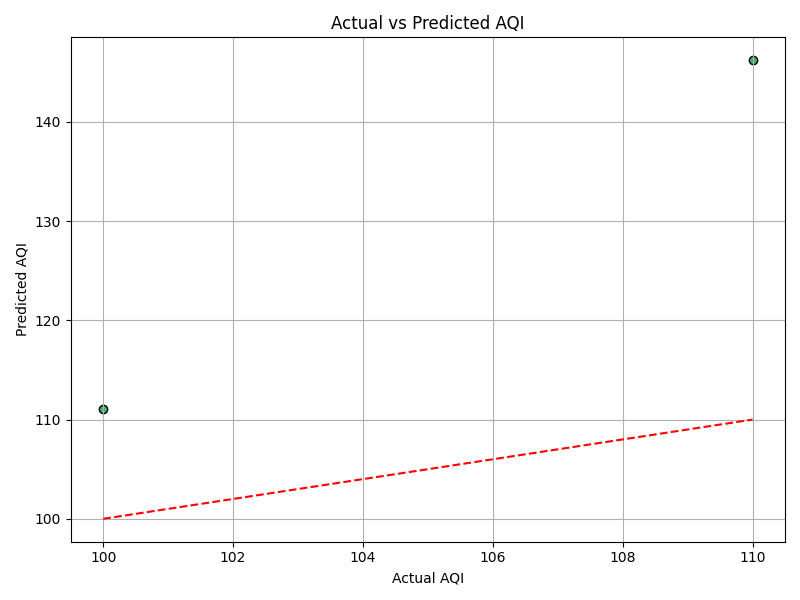

# 🌫️ AQI Prediction Web App using Machine Learning

This project predicts the **Air Quality Index (AQI)** using pollutant levels like **PM2.5, NO₂, SO₂, CO, and O₃**, through a machine learning model. Built with **Streamlit**, it offers an interactive web interface for both individual and bulk predictions.


---

## 📌 Features

- 🧪 **Real-time AQI Prediction** – Enter pollutant values manually
- 📂 **Bulk Prediction** – Upload CSV files and get AQI predictions for each row
- 📊 **Visualizations** – Feature correlation heatmap and actual vs predicted AQI graphs
- 🌍 **Multi-page UI** – Home, About, Prediction, Services, and Contact
- 💾 **Model Trained** – Using Gradient Boosting Regressor (via scikit-learn)

---

## 🧠 Technologies Used

| Category       | Tools / Libraries                        |
|----------------|-------------------------------------------|
| ML Model       | `GradientBoostingRegressor` (sklearn)    |
| Language       | Python                                   |
| Frontend       | Streamlit                                |
| Data Handling  | pandas, numpy                            |
| Visualization  | seaborn, matplotlib                      |
| Model Saving   | pickle                                   |

---

## 📈 Sample Visualizations

### 🔥 Correlation Heatmap


### 📉 Actual vs Predicted AQI


---

## 🚀 Live Demo

🌐 Hosted on **Streamlit Cloud**:  
[🔗 Click Here to Try the App](https://your-app-link.streamlit.app)  
*(Replace with your actual link after deployment)*

---

## 📦 How to Run Locally

```bash
# Clone the repo
git clone https://github.com/YOUR_USERNAME/aqi-predictor.git
cd aqi-predictor

# Install dependencies
pip install -r requirements.txt

# Run the Streamlit app
streamlit run streamlit_app.py
